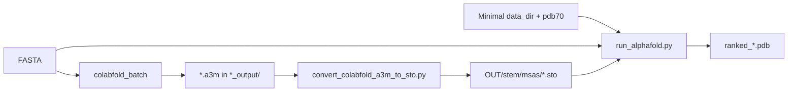

# AlphaFold2 host helpers

Scripts for **`reduced_dbs`** runs that avoid **Jackhmmer** over full UniRef/MGnify/BFD archives by supplying **precomputed MSAs** to `run_alphafold.py`.

## When to use this

| Goal | Approach |
|------|----------|
| Full genetic search inside AlphaFold | `--db_preset=full_dbs`, real database tree, `--use_precomputed_msas=false` |
| Minimal DB tree + **MSA from ColabFold** | `--db_preset=reduced_dbs`, dummy genetic DBs from `create_dummy_reduced_databases.sh`, real **pdb70**, `--use_precomputed_msas=true` |
| Tiled long sequence + ColabFold MSAs | `scripts/split_and_fold_segments_alphafold2_single_container.py` with **`.a3m` / `.a2m` input** (calls the converter per chunk) |

ColabFold is often faster or more convenient for **MSA generation**; AlphaFold2 is then used for **structure prediction** with the same alignment, without hosting multi‑terabyte genetic databases.

## ColabFold vs AlphaFold2 — what to host

Both tools support **reduced** setups (see root **`README.md`** and **`colabfold/rocm7.2.3/README.md`**). ColabFold’s default local MSA stack is **already smaller than AlphaFold `full_dbs`** (UniRef30 + env via MMseqs2, not UniRef90 + MGnify + BFD). AlphaFold2’s **`reduced_dbs` + precomputed MSAs** can be **smaller still** on disk: placeholder genetic FASTAs, real **pdb70** only, and `.sto` files from ColabFold.

| Stage | Tool | Minimal storage |
|-------|------|-----------------|
| MSA from FASTA | ColabFold | Default: public MSA API; local `/cache` mainly for **params** (optional full DB install via `colabfold.download`) |
| MSA already known | ColabFold | Input `.a3m` — no search DBs; params in `/cache` if folding in ColabFold |
| Structure | AlphaFold2 | `create_dummy_reduced_databases.sh` + pdb70 + `.sto` from **`convert_colabfold_a3m_to_sto.py`** |

## Layout AlphaFold expects (`--use_precomputed_msas`)

For each FASTA stem `QUERY` and `--output_dir=OUT`, AlphaFold reads:

```text
OUT/QUERY/msas/uniref90_hits.sto
OUT/QUERY/msas/mgnify_hits.sto
OUT/QUERY/msas/small_bfd_hits.sto
```

With `--db_preset=reduced_dbs`, the three `.sto` files may contain the **same** MSA (the converter writes identical content to all three). You still need a **minimal `--data_dir`** (placeholders + real pdb70) — see **`create_dummy_reduced_databases.sh`** and root **`README.md`**.

If any `.sto` is missing, AlphaFold runs **Jackhmmer** and requires real genetic FASTAs at `--uniref90_database_path`, etc.

## `convert_colabfold_a3m_to_sto.py`

Converts a **ColabFold-style `.a3m`** (e.g. from `colabfold_batch` output `…_output/query.a3m`) into the three Stockholm files above.

- Strips ColabFold/mmseqs comment lines (`#…`).
- Parses with AlphaFold’s `alphafold.data.parsers` — run **inside the AlphaFold2 image** (or any env with the `alphafold` package on `PYTHONPATH`).

```bash
# Inside AlphaFold2 container (paths under /work are typical bind mounts)
python3 /path/to/GPU_biology/alphafold2/scripts/convert_colabfold_a3m_to_sto.py \
  /work/colabfold_out/query_output/query.a3m \
  /work/af2_out/query/msas
```

Arguments:

1. **`a3m_path`** — input `.a3m`
2. **`output_dir`** — directory that will contain the three `*_hits.sto` files (created if needed)

## `run_af2.sh` — example single-sequence run

Wrapper around `run_alphafold.py` with **`reduced_dbs`**, **`--use_precomputed_msas=true`**, and optional auto-conversion from ColabFold.

Environment variables:

| Variable | Default | Meaning |
|----------|---------|---------|
| `FASTA` | `/work/inputs/10aa.fasta` | Input FASTA |
| `OUTPUT_DIR` | `/work/af2_output` | `--output_dir` |
| `ALPHAFOLD_DATA_DIR` | `/work/databases` | Minimal database tree |
| `USE_PRECOMPUTED_MSAS` | `true` | Set `false` to run Jackhmmer (needs real genetic DBs) |
| `COLABFOLD_A3M` | *(unset)* | If set, runs `convert_colabfold_a3m_to_sto.py` into `OUTPUT_DIR/<fasta_stem>/msas/` before fold |

Example — MSA from ColabFold, fold with AlphaFold2:

```bash
export FASTA=/work/inputs/query.fasta
export OUTPUT_DIR=/work/af2_out
export ALPHAFOLD_DATA_DIR=/work/databases
export COLABFOLD_A3M=/work/colabfold_out/query_output/query.a3m

# Mount GPU_biology alphafold2/scripts into the container, or copy run_af2.sh there.
bash /path/to/GPU_biology/alphafold2/scripts/run_af2.sh
```

Inside the **GPU_biology AlphaFold2 image**, `run_alphafold.py` lives at **`/app/alphafold/run_alphafold.py`**. Edit `run_af2.sh` or set `ALPHAFOLD_HOME=/app/alphafold` if your copy still points at a sibling `run_alphafold.py`.

Equivalent flags (see script for full list):

```text
--model_preset=monomer
--db_preset=reduced_dbs
--use_precomputed_msas=true
--max_template_date=1900-01-01
--data_dir=… --pdb70_database_path=…/pdb70/pdb70
```

## End-to-end workflow (ColabFold MSA → AlphaFold2 fold)



1. Bootstrap **`/work/databases`**: `create_dummy_reduced_databases.sh`, then download **pdb70** (root **`README.md`**).
2. Run **ColabFold** on the query FASTA; note the output `.a3m` (under `…_output/`).
3. **Convert** A3M → `.sto` (converter or `COLABFOLD_A3M=… run_af2.sh`).
4. **Fold** with `run_alphafold.py` / `run_af2.sh` and `--use_precomputed_msas=true`.

## Tiling + stitch with A3M input

**`scripts/split_and_fold_segments_alphafold2_single_container.py`** accepts **FASTA, A2M, or A3M**. For MSA inputs it slices alignments per chunk, writes chunk FASTAs, and calls **`convert_colabfold_a3m_to_sto.py`** into each chunk’s `msas/` directory before `run_alphafold.py`. Defaults match `run_af2.sh` (`reduced_dbs`, precomputed MSAs).

```bash
python3 scripts/split_and_fold_segments_alphafold2_single_container.py \
  /work/long_query.a3m \
  --output-dir-base /work/af2_chunks \
  --data-dir /work/databases
```

The two-container host script **`split_and_fold_segments_alphafold2.py`** is **FASTA-only**; pre-convert MSAs per chunk or use the single-container script for A3M.

## `create_dummy_reduced_databases.sh`

Creates placeholder genetic DB files and mmcif layout for **`--db_preset=reduced_dbs`**. Does **not** replace pdb70 or real MSAs. See generated **`README_GPU_biology_minimal_dbs.txt`** in the output tree.

## Related docs

- Root **`README.md`** — database layouts (full vs minimal) and customer workflow.
- **`alphafold2/rocm7.2.3/README.md`** — build and run the AlphaFold2 container.
- **`colabfold/rocm7.2.3/README.md`** — ColabFold cache and `colabfold_batch` defaults.
- **`scripts/README.md`** — host tiling/stitch entrypoints.
